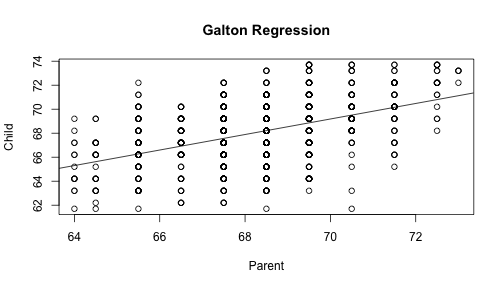

## Predict Child Height Using the Galton Dataset

1. Edit YAML front matter
2. Write using R Markdown
3. Use an empty line followed by three dashes to separate slides!

--- .class #id 

## Plot


---


## Plot 2


---

## Test Slide 2

This is test slide 2

---

## Using Regression on Galton to get Prediction


```r
lm(Galton$child ~ Galton$parent)
```

```
## 
## Call:
## lm(formula = Galton$child ~ Galton$parent)
## 
## Coefficients:
##   (Intercept)  Galton$parent  
##       23.9415         0.6463
```

---

## plot 4
Lets create a simple plot

```r
require(ggplot2)
qplot(parent, child, data = Galton)
```
 
---


